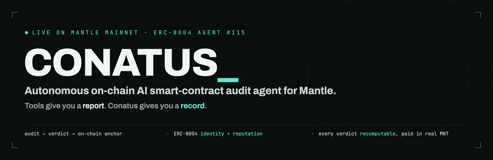
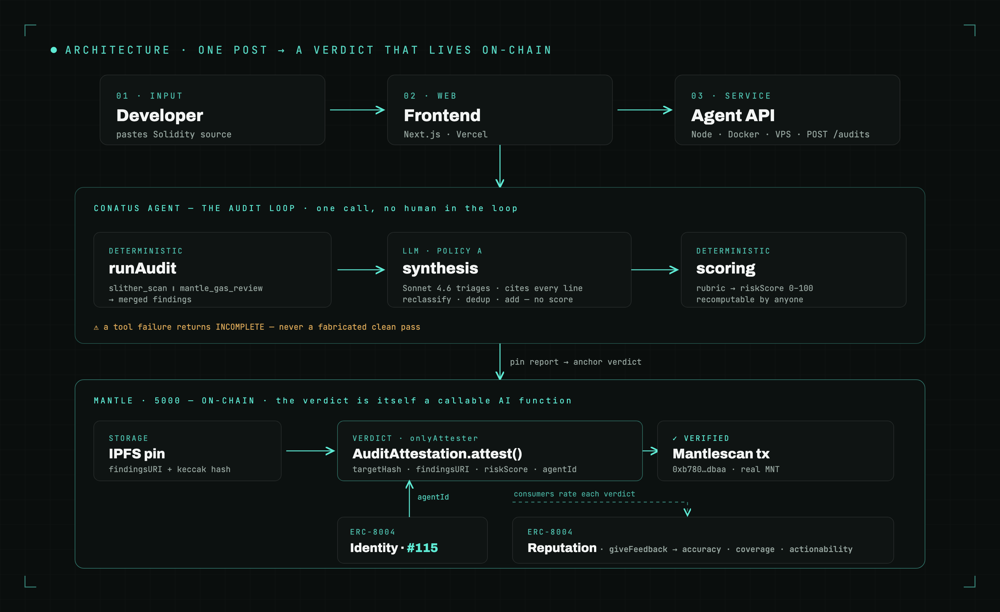
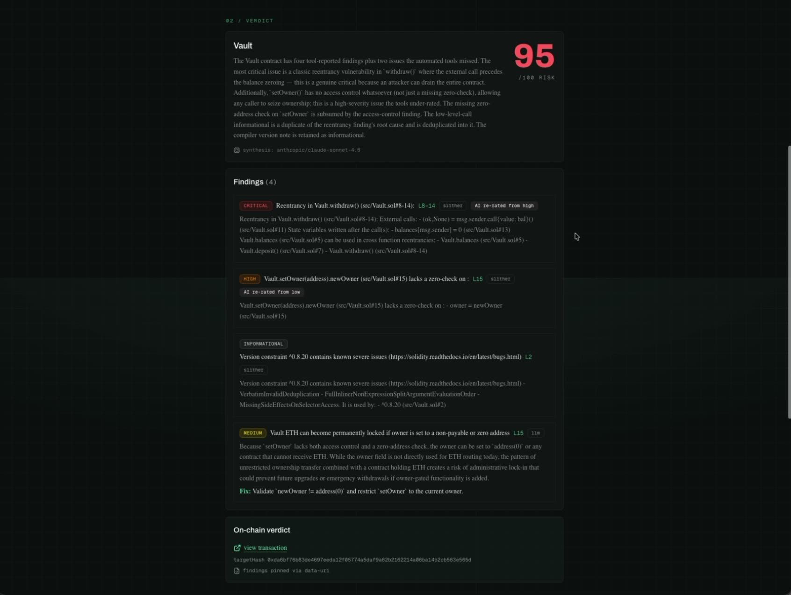
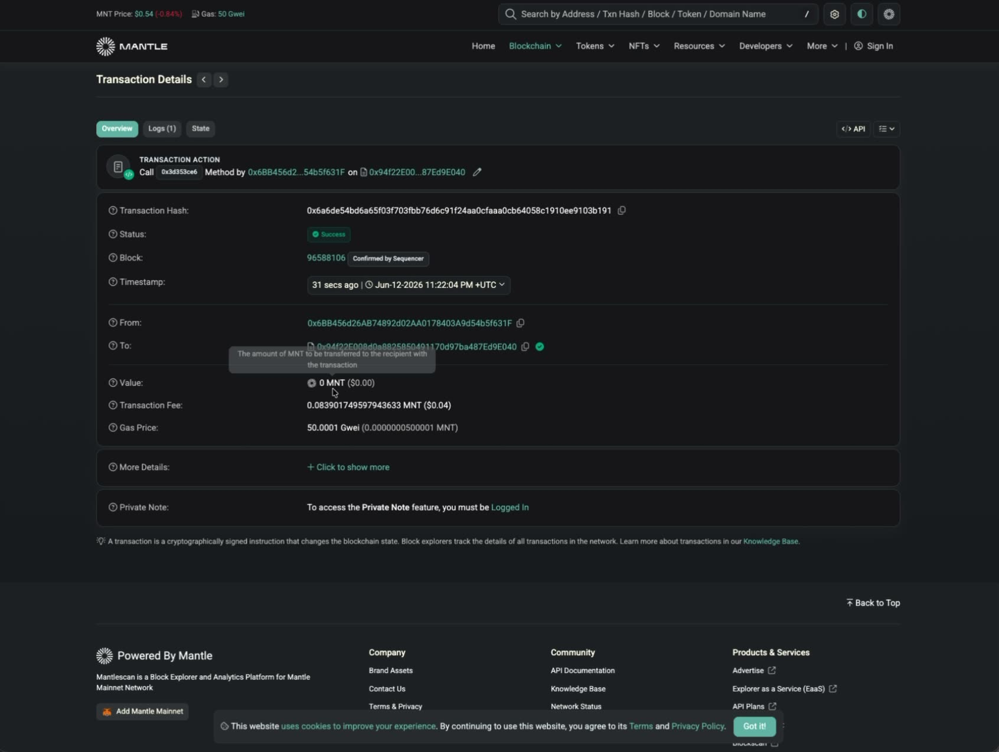
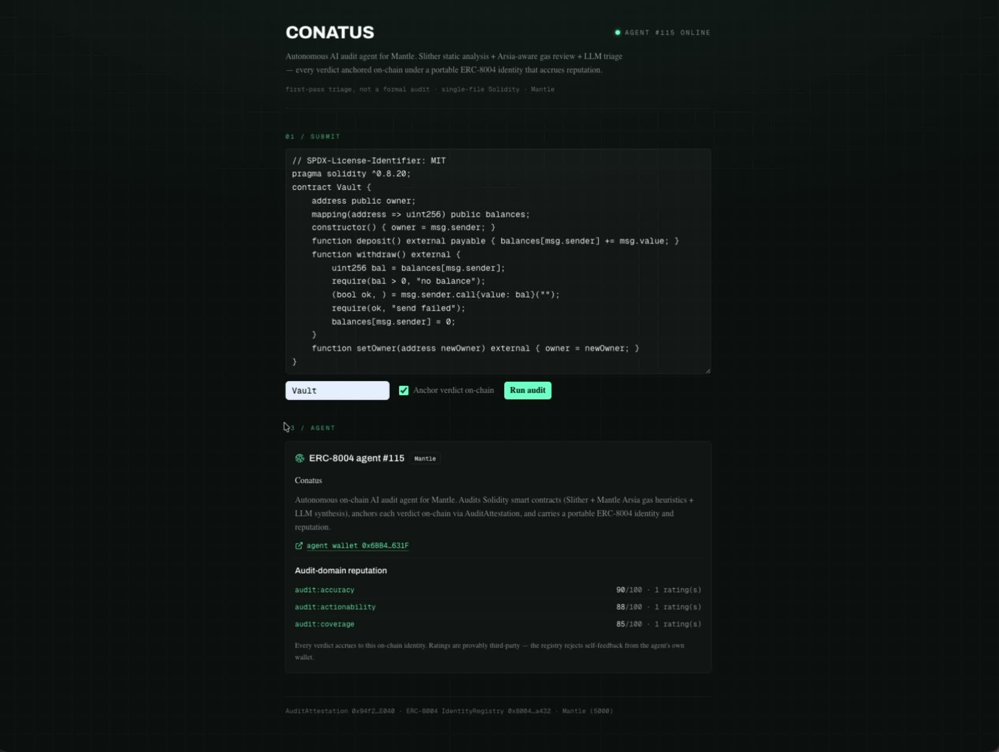

<p align="center">
  
</p>

<p align="center">
  
  
  <a href="https://conatus.rectorspace.com"></a>
  <a href="https://mantlescan.xyz/address/0x94f22E008d0a8825850491170d97ba487Ed9E040"></a>
  
  
  
</p>

<p align="center">
  <b>Conatus audits a Solidity contract, then writes its verdict on-chain</b> — a risk score, the findings hash, and its own ERC-8004 agent identity, anchored to Mantle in the same run. Most "AI audit" tools hand you a chat reply you have to trust. Conatus hands you a&nbsp;<b>record you can verify</b>.
</p>

<p align="center">
  <a href="https://conatus.rectorspace.com"><b>Live app</b></a> &nbsp;·&nbsp;
  <a href="https://conatus.rectorspace.com/pitch">Demo &amp; pitch</a> &nbsp;·&nbsp;
  <a href="https://mantlescan.xyz/address/0x94f22E008d0a8825850491170d97ba487Ed9E040">Contract on Mantlescan</a> &nbsp;·&nbsp;
  <a href="#run-it-yourself">Run it yourself</a>
</p>

> **Grand Champion — Mantle Turing Test Hackathon 2026.** Conatus took the top
> prize out of all submissions ($9,000) **and** Best in Track — Dev Tool ($8,500),
> $17,500 combined. Hosted on Mantle with Bybit, Byreal, and the Blockchain for
> Good Alliance.

> *Conatus* (Spinoza): the innate drive of a thing to persist in its own being — an agent that reasons, acts, and leaves a permanent trace.

---

## Contents

- [Why Conatus](#why-conatus)
- [Architecture](#architecture)
- [How the agent works](#how-the-agent-works)
- [On-chain identity &amp; reputation](#on-chain-identity--reputation)
- [Live deployment](#live-deployment)
- [Run it yourself](#run-it-yourself)
- [API](#api)
- [Project layout](#project-layout)
- [Testing](#testing)
- [Security &amp; scope](#security--scope)

---

## Why Conatus

Three things separate it from an "audit my Solidity" chat wrapper:

- **The verdict lives on-chain.** Every audit writes `{ targetHash, findingsURI, riskScore, agentId }` to an `AuditAttestation` contract on Mantle. The result *is* a callable on-chain AI function — not an API response you take on faith.
- **The score is deterministic and Mantle-aware.** The LLM never invents a number; a published rubric computes `riskScore` from the findings, so **anyone can recompute the on-chain score from the pinned report.** A dedicated `mantle_gas_review` tool reasons in Mantle's cost model — cheap L2 execution, L1 data-availability dominated by calldata + storage — not generic gwei.
- **The agent has a portable identity that accrues reputation.** Conatus is registered as **ERC-8004 agent #115**; every attestation references its `agentId`, and consumers rate each audit along audit-quality dimensions (`accuracy`, `coverage`, `actionability`). The track record *is* the benchmark.

## Architecture

<p align="center">
  
</p>

A Next.js frontend (Vercel) takes Solidity source and calls the **agent service** — Node, Dockerized on a VPS, because Slither needs a real Python/solc runtime that serverless functions can't host. The agent runs a deterministic tool pass, an LLM triage pass, and a deterministic score; pins the full report to IPFS; and anchors the verdict on Mantle against its ERC-8004 identity. The frontend then renders the report, the Mantlescan link, and the identity/reputation card.

## How the agent works

Given a contract, the agent runs the entire loop itself — tool calls, triage, scoring, the IPFS pin, and the on-chain write — and signs the result with its own identity. No human picks the findings or the score. It's **deterministic where it counts, LLM where it helps, and it never lies when a tool breaks.**

1. **`runAudit` — deterministic.** Runs `slither_scan` (static analysis) and `mantle_gas_review` (Mantle gas/DA heuristics) in parallel, merges their findings, and computes `targetHash = keccak256(canonicalized source)` — the on-chain key, stable across trivial formatting.
2. **`synthesis` — LLM · Policy A.** Claude Sonnet 4.6 (via OpenRouter, `temperature: 0`) triages the tool output through a single constrained tool-call. It may **reclassify** a severity (original preserved in `adjustedFrom`), **dedup** a finding into an equal-or-higher one, or **add** a finding the tools missed — *but only with a cited line range.* It assigns **no score**, and any operation without a citation is discarded and counted.
3. **`scoring` — deterministic.** A published rubric maps findings → `riskScore` 0–100, where **higher = riskier** (`critical 60 · high 25 · medium 10 · low 3`; gas/quality notes carry zero risk weight), each discounted by confidence. Recomputable by anyone, from the findings alone.
4. **`anchor`.** The report is pinned to IPFS (`findingsURI` + keccak hash; deterministic `data:` fallback), then `AuditAttestation.attest(targetHash, findingsURI, riskScore, agentId)` writes the verdict to Mantle — simulated first so a would-be revert fails fast, and a mined-but-reverted tx is never mistaken for success.

> **The integrity rule:** if Slither or the gas tool errors, the report is marked `INCOMPLETE` with an explicit reason — *never a fabricated clean pass.* Absence of findings after a tool failure is never read as "safe."

**Worked example (the demo `Vault`):** Slither flags a reentrancy as *high*; the LLM **re-rates it CRITICAL** — the external call precedes the balance zeroing — and **adds** a *medium* the tools missed (ETH lock-in via an unguarded `setOwner`). The rubric lands a high-80s–90s `riskScore` (87 on the first mainnet run, 95 in the recorded demo), correctly screaming *do not ship*. The score moves run-to-run only because the LLM's finding set isn't identical each time — the rubric is fixed, so **each score is fully reproducible from its own report.** [Watch it on /pitch →](https://conatus.rectorspace.com/pitch)

## On-chain identity &amp; reputation

Conatus is built on the **ERC-8004** trustless-agent registries, live on Mantle:

- **Identity** — registered once via `IdentityRegistry`, minting agent **#115**, owned by the agent wallet. Every attestation carries that `agentId`, so a verdict is provably *this* agent's.
- **Reputation** — consumers call `ReputationRegistry.giveFeedback`, tagged by audit-quality **dimension** (`audit:accuracy`, `audit:coverage`, `audit:actionability`) and by the audited `targetHash`, so reputation is queryable per-contract. The contract **blocks the agent from rating itself** on-chain — the scores are provably not ours.

> **Honest disclosure:** the current ratings (accuracy 90 · coverage 85 · actionability 88) are an **operator-seeded baseline** — a separate rater wallet demonstrating the loop, not yet organic third-party volume. The mechanism is real, on-chain, and live; the volume is bootstrap.

## Live deployment

Everything below is **live on Mantle mainnet (chain 5000)** and verifiable right now:

| | |
|---|---|
| **App** | [conatus.rectorspace.com](https://conatus.rectorspace.com) · [/pitch](https://conatus.rectorspace.com/pitch) |
| **Agent API** | [`/healthz`](https://conatus-api.rectorspace.com/healthz) → `{ agentId: "115", chainId: 5000 }` |
| **AuditAttestation** | [`0x94f2…E040`](https://mantlescan.xyz/address/0x94f22E008d0a8825850491170d97ba487Ed9E040) — attester = the agent wallet |
| **IdentityRegistry** | [`0x8004A169…A432`](https://mantlescan.xyz/address/0x8004A169FB4a3325136EB29fA0ceB6D2e539a432) — agent **#115** |
| **ReputationRegistry** | [`0x8004BAa1…9b63`](https://mantlescan.xyz/address/0x8004BAa17C55a88189AE136b182e5fdA19dE9b63) |
| **Agent wallet** | [`0x6BB4…631F`](https://mantlescan.xyz/address/0x6BB456d26AB74892d02AA0178403A9d54b5f631F) |
| **First verdict (real MNT)** | [`0xb780…dbaa`](https://mantlescan.xyz/tx/0xb7804b79e3bb239689c4b2428dafde152ab32f63c73563677e01bea8b00ddbaa) — riskScore 87 |
| **ERC-8004 registration** | [`0x0a81…7158`](https://mantlescan.xyz/tx/0x0a81e87d822280bf5279845f135d001eb82f7bf3a298d82f66c4fd469d0b7158) |

> `AuditAttestation` deploys to the **same address on both chains** (deterministic, nonce 0). A Sepolia testnet stack (agent #130) also runs for safe development.

<p align="center">
  
  &nbsp;
  
  &nbsp;
  
</p>

## Run it yourself

<details>
<summary><b>Prerequisites &amp; full local setup</b></summary>

**Prerequisites:** Node 20+, [pnpm](https://pnpm.io) 10, [Foundry](https://book.getfoundry.sh) (`forge`/`cast`), Python 3 + [Slither](https://github.com/crytic/slither) (`pip install slither-analyzer`) and `solc`, an [OpenRouter](https://openrouter.ai) API key, and a Mantle wallet funded with MNT for anchoring. IPFS pinning (a Pinata JWT) is optional — the agent falls back to a deterministic `data:` URI.

```bash
git clone https://github.com/RECTOR-LABS/conatus
cd conatus
cp .env.example .env        # fill in LLM_API_KEY, AGENT_PRIVATE_KEY, ATTESTATION_ADDR, AGENT_ID, CONATUS_API_TOKEN…

# 1 · Contracts (Foundry)
cd contracts
forge test                                                            # 10 passing
forge script script/Deploy.s.sol --rpc-url "$MANTLE_RPC_URL" --broadcast   # deploys AuditAttestation

# 2 · Agent service
cd ../agent
pnpm install
pnpm test                   # 65 passing
pnpm dev                    # http://localhost:8787  ·  POST /audits
pnpm e2e                    # headless: audit a sample contract → anchor the verdict on-chain

# 3 · Frontend
cd ../web
cp .env.example .env.local  # CONATUS_API_URL, NEXT_PUBLIC_* …
pnpm install && pnpm dev    # http://localhost:3000
```

No secrets live in source — every key is referenced by env var, and `.env` is gitignored. `.env.example` documents every name.

</details>

## API

<details>
<summary><b>Agent service endpoints</b></summary>

| Method | Path | Auth | Body / Result |
|---|---|---|---|
| `GET` | `/healthz` | — | → `{ ok, version, agentId, chainId }` |
| `POST` | `/audits` | `X-API-Token` | `{ source, contractName?, anchor? }` → `202 { id }` |
| `GET` | `/audits/:id` | `X-API-Token` | → `{ id, status, report?, anchorResult?, error? }` |

Submissions are rate-limited (5 per 10 min per IP); `source` ≤ 100k chars; request body ≤ 512KB; CORS is restricted to `ALLOWED_ORIGIN`. The submitted source is never echoed back in a job view.

</details>

## Project layout

```
conatus/
├─ agent/                      # Node audit service
│  ├─ src/
│  │  ├─ audit/runAudit.ts     # deterministic tool pass + targetHash
│  │  ├─ tools/                # slither_scan · mantle_gas_review
│  │  ├─ synthesis.ts          # LLM triage (Policy A) — no score, cited ops only
│  │  ├─ scoring.ts            # deterministic riskScore rubric
│  │  ├─ anchor.ts             # IPFS pin + AuditAttestation.attest()
│  │  ├─ feedback.ts           # ERC-8004 reputation payloads
│  │  └─ server.ts             # HTTP API + job queue
│  └─ test/                    # 65 vitest specs
├─ web/                        # Next.js frontend (Vercel) — paste-to-audit, report, identity card
├─ contracts/                  # Foundry — AuditAttestation.sol + deploy + tests
├─ SPEC.md · PLAN.md · CORE.md # design spec · build plan · shared agentic-EVM core
└─ docs/                       # demo kit + marketing assets
```

## Testing

```bash
cd agent     && pnpm test     # 65 — tools, synthesis guards, scoring, anchor, reputation, server
cd web       && pnpm test     # 10 — report rendering, aggregation, feedback, hooks
cd contracts && forge test    # 10 — attest access control, validation, getAttestation
```

`pnpm typecheck` is clean across `agent/` and `web/`. The synthesis guards (cited-ops-only, no-self-score, dedup never escalates) and the contract's `onlyAttester` access control are covered directly.

## Security &amp; scope

- **First-pass triage, not a formal audit** — stated in-product. It does not replace a human or formal review.
- **Single-file Solidity** — no multi-file import-graph resolution in the MVP.
- **No secrets in source** — all configuration is via env vars; `.env` is gitignored; the public repo ships only `.env.example`.
- **One writer** — the agent wallet is the sole `attester`; no third party can spoof or overwrite a verdict.

## License

MIT — see [`LICENSE`](./LICENSE). Part of the **Conatus / Conclave / Wisp** agentic-EVM campaign on a shared core ([`CORE.md`](./CORE.md)). Design spec: [`SPEC.md`](./SPEC.md) · build plan: [`PLAN.md`](./PLAN.md).

<sub>Grand Champion & Best in Track (Dev Tool) — Mantle “Turing Test” Hackathon 2026 · #MantleAIHackathon</sub>
